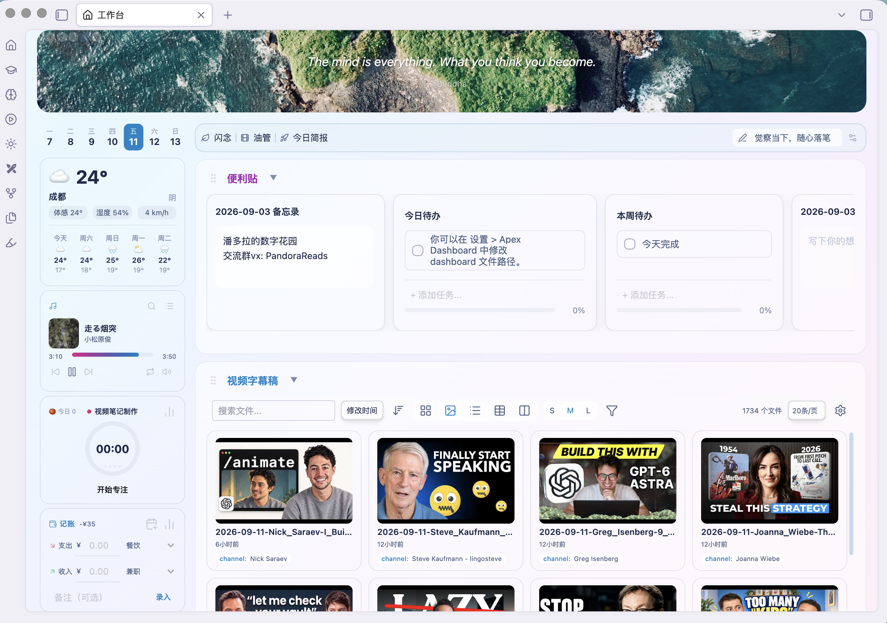
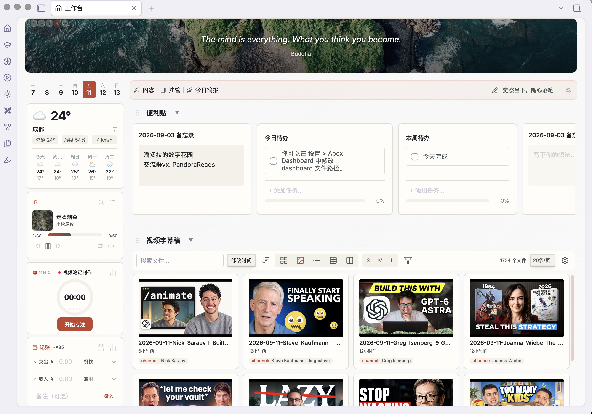
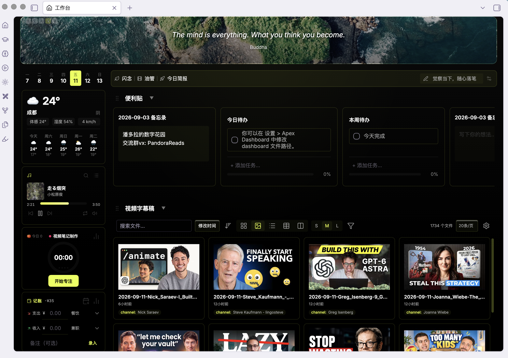

# Apex Dashboard

> Stop switching between Obsidian notes. One page. Everything you need. Memo your thoughts, crush your todos, track your projects — and make it look incredible doing it. [【中文版】](README_ZH.md)

## Screenshot

## Features

### 🗒️ Memo
Capture thoughts instantly with a built-in memo pad. Each memo card has a writable textarea — jot down ideas, meeting notes, or daily reflections without leaving your dashboard. Supports `[[wikilinks]]` that render as clickable links.

### ✅ Todo
Manage tasks with interactive checklists. Add, reorder, drag-and-drop, and check off tasks. A progress bar shows completion percentage at a glance. Todo items also support `[[wikilinks]]` for cross-referencing notes.

### 📁 Projects
Organize your vault documents into project cards. Each card links to related notes, displays a cover image (supports both local vault images and web URLs), and supports inline document search to add new files quickly. Manage multiple file types including Markdown notes, PDFs, images, audio, and video.

### 📝 Notes
A compact, list-style section for organizing reference documents and quick-access files. Displays up to 5 cards per row without cover images for maximum density.

### ✅ All Tasks
Aggregate every checkbox task across your entire vault into one section — like a dataview `TASK` query, but interactive. Search, filter by status (open / all / done), and group by date (Overdue / Today / This week / Later / No due) or by priority. Switch between a grouped list and a kanban board. Check a task off and it updates in the source note. Reads due dates (`⏰`, `[due::]`, `📅`) and priorities (`[priority:: high]`). Exclude folders like Archive/Templates from the scan.

### 📅 Calendar
A native month-grid calendar of every dated task across your vault (no dataview or external plugin needed). Each day cell lists its tasks; click a day for its agenda. Open a full-screen calendar with month navigation and inline toggling. Multi-day events with `[start::]` / `[end::]` span across days.

### ⚡ Quick Actions
Pin your most-used shortcuts to the sidebar. Supports two action types: **File** links to open any document, and **Command** shortcuts to trigger any Obsidian command. Includes built-in presets for New Journal and New Note.

### 🌤️ Sidebar Widgets
The left sidebar features decorative widgets for at-a-glance information:

- **Week Calendar** — A compact 7-day strip highlighting today's date
- **Weather Widget** — Real-time weather with current temperature, feels-like, humidity, wind speed, and a 5-day forecast with daily high/low temperatures. Powered by Open-Meteo (no API key needed). City search with geocoding autocomplete for precise location
- **Heatmap Widget** — Track daily frontmatter data (mood, sleep, etc.) as a GitHub-style contribution heatmap. Configurable summary: streak days (⚡), completion rate (✅), or both
- **Pomodoro Timer** — A focus timer with activity selector and session tracking. Start, pause, and stop timed sessions with a donut chart showing today's breakdown by activity
- **Reading Tracker** — Track your reading sessions with a built-in timer. Add books from Douban search or manual input, time your reading sessions, and record progress with page numbers. Each book card shows cover image, author, and reading progress bar
- **Countdown** — A customizable countdown to any target date, displayed as days or hours remaining

### 🎨 Banner
A customizable banner with an inspirational quote and optional background image. Supports both local vault images and web URLs. Double-click to edit.

### 🔄 Drag & Drop
Drag cards between sections to reorganize your workspace. Drag task items within Todo cards to reorder. Drag document links between project/note cards.

### 🧩 Custom Sections
Create sections with 4 built-in types — **Memo**, **Todo**, **Projects**, and **Notes** — each with its own layout and behavior. Mix and match to fit your workflow.

### 🕐 Recent Documents
The sidebar shows recently edited files with relative timestamps, so you can jump back into your latest work.

## Themes

14 handcrafted themes, each with distinct visual identity:

| Theme | Style |
|-------|-------|
| **Earth** | Warm organic tones, parchment textures |
| **Nordic** | Clean minimal with blue accents |
| **Aurora** | Frosted glass with animated aurora gradient |
| **Island** | Animal Crossing pastels, forest green and ocean blue |
| **Tundra** | Cold gray + avocado green aurora, sage glass cards |
| **Blossom** | Rose glass glow, transparent sections |
| **Haze** | Smoky white-to-blue mist, extreme glass transparency |
| **Ember** | Warm campfire smoke gradient, amber glow |
| **Jade** | Green bamboo mist, crisp jade-cut edges |
| **Matcha** | Morandi green, solid warm tones |
| **Lilac** | Morandi purple, soft and muted |
| **Eclipse** | Industrial monochrome, sharp lines |
| **Onyx** | Pure black with lemon accent, identical in light & dark |
| **Mono** | Pure black/white minimal, no glass or gradients |

All themes support both Obsidian light and dark modes.

## Settings

- **Dashboard file** — customize the file path for your dashboard data
- **Style** — choose from 14 visual themes
- **Language** — English or Chinese interface
- **Recent documents count** — control how many recent files appear
- **Sidebar widgets** — Weather, Heatmap, Pomodoro, Reading, Countdown. Enable/disable and configure each widget independently
- **Reading settings** — Toggle reading tracker, enable/disable session completion sound

## Installation

### From Obsidian Community Plugins
1. Open Settings > Community Plugins
2. Browse and search for "Apex Dashboard"
3. Click Install, then Enable

### Manual Installation
1. Download the latest release from [GitHub Releases](https://github.com/pandorareads/apex-dashboard/releases)
2. Extract into your vault's `.obsidian/plugins/apex-dashboard/` folder
3. Open Settings > Community Plugins and enable "Apex Dashboard"

## Usage

1. Open the dashboard via the ribbon icon (home icon) or command palette: `Apex Dashboard: Open dashboard`
2. A `dashboard.md` file is automatically created in your vault root
3. All changes are saved directly to the file — it's your data, in plain text

> **Note:** Deleting, renaming, or reordering sections must be done by editing the `dashboard.md` file directly. Any changes made to the note will take effect in the dashboard view immediately.

## What's New

### 1.4.4
- **TickTick timezone setting** — New configurable timezone (default `Asia/Shanghai`) fixes today's todos showing the wrong time/date when your system timezone differs from your TickTick account. Configure under Settings → TickTick → Timezone
- **Open notes directly in a tab** — New setting (plus a command-palette toggle) to skip the in-dashboard editor popover: clicking a document card opens the note in a tab immediately. Defaults off so the existing popover behavior is preserved

### 1.4.3
- **Marketplace review compliance** — Type-safety and code-quality fixes so the plugin passes the Obsidian community-plugin review: removed debug `console` logging, replaced `any` types with proper Electron typings in the TickTick browser login, added safe string-coercion helpers, and fixed section rendering to build detached DOM nodes (a regression that hid all sidebar sections). No user-facing feature changes.

### 1.4.2
- **Weread skill v1.0.4** — Bundled Weread skill updated to `skill_version` 1.0.4
- **Highlight import fix** — Importing a book's highlights into a note works again
- **Import button UI** — Refreshed the import button in the Weread section

### 1.4.1
- **TickTick view toggle** — List/kanban view switch for the TickTick section
- **Heatmap polish** — Visual refinements to the Heatmap section
- **Performance fixes** — General rendering and performance improvements
- **Ember removal** — Removed leftover "ember" UI artifacts

### 1.4.0
- **New sections** — Weread, TickTick, and Heatmap section types
- **Section reorder & resize** — Reorder sections and adjust their heights
- **Card properties** — Per-card size, grid span, color, and cover image

### 1.3.1
- **Multi-folder support** — Media, folder, and library sections can target multiple folders
- **UI fixes** — Removed duplicate config buttons on folder/library sections; restored the library section's delete button

### 1.3.0
- **Plugin review fixes** — Resolved Obsidian community-plugin review feedback: popout-window support via `activeDocument`, CSS partial-support warnings, ESLint globals, and CI lint-config tracking

### 1.2.9
- **Calendar week view** — New Month | Week toggle on the Calendar section. In-column week view is a compact vertical list (sorted by time, with time labels); the full-screen modal's week view is a Google-Calendar-style time grid (hour axis + 7 day columns, tasks positioned/sized by time, all-day strip, "now" line). Times come from `⏰` reminders and `[due::]`/`[start::]`/`[end::]` with `HH:MM`
- **Add tasks from the calendar** — Click a day → its agenda lets you add a task (optional time) that writes to that day's daily note (auto-created from the Daily Notes template/path); timed with `⏰`, date-only with `📅`
- **Removed: All Tasks section** — It scanned every markdown file in the vault on each render, which overheated phones. The Calendar section still covers dated-task aggregation
- **Performance & mobile fix** — Video thumbnails no longer leak media decoders (fixed runaway memory + phone overheating/freezing); on mobile they render static placeholders. Editing a note now refreshes only the affected section in place instead of rebuilding the whole board (no more "video library keeps refreshing")
- **Lazy video (desktop) + faster scan + mobile GPU** — Only on-screen tiles mount a real `<video>` (IntersectionObserver); the vault-task scan (Calendar) skips task-less files and yields to the UI; the per-card glass blur is disabled on mobile (≤640px) to cut GPU load and heat

### 1.2.8
- **All Tasks section** — New section type that aggregates every checkbox task across the vault (like a dataview `TASK` query); search, status filter, and sort
- **Grouping + kanban** — Group tasks by date (Overdue/Today/This week/Later/No due) or priority; list view with collapsible groups, or kanban board with one column per group
- **Task write-back** — Check a task in the All Tasks or Calendar view and it updates the checkbox in the source note
- **Due dates & priority** — Reads `⏰`, `[due::]`, `📅` due dates and `[priority::]` priorities
- **Calendar section** — New section type: native month grid of every dated task across the vault, with a compact in-column view and a full-screen calendar modal; multi-day events (`[start::]`/`[end::]`) span across days
- **Exclude folders** — All Tasks and Calendar sections can exclude vault folders (e.g. Archive/Templates) from aggregation

### 1.2.7
- **Thumbnail size toggle** — Images/videos grid view has an S/M/L size toggle in the toolbar (medium = previous size)
- **Backlinks** — Images/videos list & table views show which notes link to / embed each file; click a chip to open that note in the in-place editor popover
- **Per-page selector** — Images/videos sections: choose 20 / 50 / 100 items per page
- **Mobile note popover** — On mobile, clicking document links and wikilinks now opens the in-place note editor popover (matching desktop; previously it opened a new tab)
- **Taller sections + toolbar layout** — Images/videos sections are taller by default; the file count and per-page selector sit at the far right of the toolbar
- **Overlap fixed** — Images/videos sections no longer overlap the content below after the height increase

### 1.2.6
- **Media pagination** — Images/videos sections pagination now matches the database section: centered, with multiple page numbers (first/last + ellipsis), instead of a single prev/next
- **Media folder picker** — The filter funnel's folder field now has a "Browse" button that opens a fuzzy folder search (same as the folder section config), instead of typing the path manually

### 1.2.5
- **Tag filter removed from toolbar funnel** — The database/folder section's filter (funnel) popup no longer has a tag filter (it was redundant); it does date filtering only. The folder section's tag filter in its gear config dialog is unchanged

### 1.2.4
- **Media filter funnel** — Images/videos sections gained a toolbar filter funnel: filter by created/modified date range and by folder path (subfolders included); active filters show as removable chips
- **Fixed-width Name column** — Images/videos table view Name column is now a fixed width with ellipsis, instead of growing with long filenames

### 1.2.3
- **Media list & table views** — Images/videos sections now support list and table views (in addition to the grid thumbnail wall) via a toolbar toggle
- **Rename media files** — Double-click a file's name in the table view to rename it; `![[embeds]]` and `[[links]]` update automatically
- **Delete media files** — A trash button (with confirmation) on every media item in grid/list/table; deleted files go to Obsidian's trash (recoverable)
- **Pomodoro week/month stats fixed** — Week/month now use calendar boundaries (Mon→Sun / 1st→end) instead of a rolling 7/30-day window
- **Media lightbox fixed** — Images/videos now fill and center correctly in the viewport

### 1.2.2
- **Tag filter moved to toolbar funnel** — The database section's tag filter moved from the config dialog to the funnel popup (alongside the date filter)
- **Value search repositioned** — Database config: the property value search box now sits to the right of the property dropdown (same row) instead of below it
- **Folder card tag limit** — Folder section grid cards show at most 2 tags (+N badge) on a single non-wrapping line, so cards no longer grow taller with many tags

### 1.2.1
- **Images section** — A new section type that scans the whole vault for images (png/jpg/jpeg/gif/svg/webp/bmp) and shows them as a thumbnail wall; click any thumbnail to open a full-screen lightbox (←/→ to browse, Esc to close)
- **Videos section** — Same idea for videos (mp4/mov/mkv/avi/webm/m4v); the grid shows the first frame with a play badge, click to play inline in the lightbox
- Both sections support search, sort, and pagination

### 1.2.0
- **Edit quick actions** — Hover a custom quick link/command chip to reveal an edit button (top-left); click to rename it and pick a new icon. Desktop only
- **Delete section** — Every section header now has a trash button that removes the whole section after a confirmation dialog
- **"New Journal" fixed** — The quick action now goes through Obsidian's command system, so the created daily note honors the core Daily notes plugin's folder, date format, and template settings

### 1.1.9
- **Folder cards show tags** — Folder section grid cards now show the file's tags (as chips) instead of the folder path on the meta row
- **Value search box** — Database config: each property value picker now has a search box to filter the chip list
- **Kanban defaults to tags** — Database config "Group by" now defaults to tags (with a hint)

### 1.1.8
- **Tag filter** — Folder and database sections gained a dedicated Tags filter section (toggleable chips; a file shows if it has any selected tag)

### 1.1.7
- **Folder section** — A new section type that lists every document under a chosen vault folder (including subfolders). Pick a folder by typing the path or browsing with a fuzzy picker; the display reuses the database section's grid/list/table/kanban views with sort, search, and pagination

### 1.1.6
- **Save todo to daily note** — A new save button on each todo card writes its tasks (with completion state and nesting preserved) to the top of today's daily note (located via the core Daily notes plugin settings)
- **Archive completed tasks** — A new archive button on the todo section header moves every checked task into a single accumulating archive file as a timestamped log
- **Task archive path setting** — New setting for the archive file path (defaults to `归档/已完成.md`)

### 1.1.5
- **Hover preview for links** — Hold Ctrl/Cmd and hover over any document link or `[[wikilink]]` to see a native page-preview popover without leaving the dashboard. Works across project/note card doc lists, inline wikilinks in memos and todos, and the database (library) section
- **In-place note editor popup** — Click a link to open a centered popup that embeds a full Obsidian Markdown editor (Live Preview, plus a reading/source toggle that remembers your last choice). Read and edit the note right inside the dashboard instead of opening a new tab; an "Open in tab" button is available when you want the full editor
- **Database section support** — Library files in grid, list, table, and kanban views now support hover preview and the in-place edit popup, matching the project section experience
- **Mobile unchanged** — On mobile, links keep their original open-in-tab behavior

### 1.1.4
- **Collapsible subtasks** — Tasks with subtasks can now be collapsed; the collapsed state persists across reloads. Only items with children show a toggle arrow, so leaf items carry no extra left padding and lists stay compact
- **Nested document links (sub-documents) in project cards** — Document links in project cards now support nesting just like subtasks: drag one onto another to nest it (before / after / nest drop zones), and collapse a parent's sub-documents. Saved as indented Markdown nested lists so links stay valid in every Obsidian view (no code-block breakage from indentation)
- **Nested tasks (subtasks)** — Tasks now support multi-level nesting, persisted as indented Markdown. Drag a task onto another to nest it (before / after / nest drop zones), reorder tasks, or move them across cards. On mobile, long-press to drag and swipe horizontally to nest/unnest. Checking a parent task checks all of its children
- **Two new themes: Mono & Onyx** — Added Mono (pure black/white minimal, no glass or gradients, system-adaptive) and Onyx (pure black with a lemon accent, identical in light & dark). Removed the Spring (Prism) theme
- **Heatmap widget enhancements** — The sidebar heatmap can now resolve daily journal files from a configurable folder, supports a custom display title, and offers two range modes: rolling (last N days) or period (current month / quarter / year)
- **Sidebar calendar auto-refresh** — The sidebar week calendar now updates its "today" highlight and dates automatically after midnight, even when the dashboard view is pinned open (previously it stayed frozen on the day it was first opened)
- **Quick action custom naming** — When adding a file or command quick action, you can now set a custom display name (and choose an icon) on the confirm step, instead of being stuck with the default name
- **Mobile drag afterimage fix** — Long-pressing a card to drag on mobile no longer leaves a permanent text afterimage on screen when the touch is interrupted by the system (edge gestures, notifications, scroll hijack). A touchcancel handler now cleans up the drag ghost, stranded ghosts are swept on re-render, and transitions on the ghost clone and dragging card are disabled to remove trailing afterimages
- **Save memo as note** — Memo cards can be saved as standalone notes in your vault via a new "Save as note" button, with a configurable save folder (memoSavePath setting)

### 1.1.3
- **Mobile widget bar redesign** — Replaced the overlapping tab buttons with a collapsible strip below the banner. Tap the strip to reveal wider bookmark tabs (Pomodoro, Reading, Lunar), then tap a tab to expand its widget panel
- **Theme-aware tab colors** — Tab icons now transition from gray (inactive) to the theme primary text color (active), adapting to both light and dark themes
- **Updated widget icons** — Pomodoro uses hourglass icon, Lunar uses moon icon for clearer visual identity
- **Custom dialogs** — Replaced native browser dialogs with Obsidian-styled custom modals
- **Class rename** — Cleaned up internal class naming conventions
- **Style improvements** — Various visual polish and consistency fixes

### 1.1.2
- **Obsidian plugin review fixes** — Addressed feedback from the official Obsidian plugin review process
- **MIT license** — Changed license from ISC to MIT

### v1.1.1
- **Library config persistence** — Fixed a critical bug where library section configurations (filters, view mode, sort settings, page size) were lost after restarting Obsidian. The YAML parser now correctly handles nested objects in column definitions
- **Grid position persistence** — Fixed grid position (gcol/grow) values never being saved to the dashboard file, causing card positions to reset on reload
- **Write race condition fix** — Fixed a race condition where rapid updates could cause the file watcher to overwrite newer data with older content

### v1.1.0
- **Reading Tracker widget** — Full reading session management in the sidebar: add books from Douban search or manual input, start/pause/stop reading timer, and save sessions with page progress
- **Book cards** — Each active book displays cover image, title, author, reading progress bar, and today's reading time. Cover images support both web URLs and local vault paths
- **Edit book info** — Hover a book card to reveal edit (pencil) and remove (x) buttons. Edit modal supports changing title, author, total pages, and cover image URL/path
- **Reading statistics** — Full stats page with total reading time, today's reading, book count, streak days, book list by time range (week/month/year), and recent session records. Delete individual records or entire book histories
- **Pomodoro activity selector** — Activity selector moved to the timer title position with a dropdown picker for categorizing focus sessions
- **Pomodoro donut chart** — Visual breakdown of today's focus sessions by activity, displayed as a donut chart in the stats view

### v1.0.8
- **Sidebar weather widget** — Real-time weather with current temperature, feels-like temperature, humidity, wind speed, and a 5-day forecast (daily icons + high/low). Powered by Open-Meteo, no API key required
- **Sidebar heatmap widget** — GitHub-style contribution heatmap for tracking daily frontmatter data (mood, sleep, weight, etc.)
- **Heatmap summary** — Configurable stats below the heatmap: streak days (⚡), completion rate (✅), both, or off
- **Week calendar strip** — Compact 7-day strip in the sidebar highlighting today
- **City search** — Geocoding autocomplete when configuring the weather city in settings
- **Dashboard weather cards** — Weather card widgets in the main dashboard also show feels-like, humidity, and wind
- **i18n** — All sidebar widget settings now support both English and Chinese
- **5 new themes** — Matcha (green tea warmth), Lilac (soft purple), Sakura (cherry blossom pink), Eclipse (dark mode), Moonlight (silver blue)

### v1.0.7
- **Task reminders** — Set per-task reminders with a calendar popup. Click the bell icon on any task to pick a date and time
- **Calendar picker** — Visual month calendar with navigation, day selection, and hour/minute dropdowns (no manual date typing)
- **Overdue indicator** — Overdue task bell icon turns red with a pulse animation
- **Obsidian notifications** — 60-second periodic checker triggers an Obsidian Notice when a task is due
- **Inline markdown storage** — Reminders stored as `⏰ YYYY-MM-DD HH:MM` in task text, fully readable and editable in the markdown file
- **Island theme** — New Animal Crossing-inspired pastel theme with forest green sections and ocean blue accents
- **i18n** — Reminder UI supports both English and Chinese
- **Resizable section cards** — Drag to resize any card within a section, with min/max width constraints and persistent sizing
- **Collapsible sidebar** — Left sidebar is now resizable; click the pin button to fix it in place
- **6 new themes** — Tundra (sage green aurora), Blossom (rose glass, transparent sections), Haze (smoky blue mist, glass transparency), Ember (warm campfire smoke), Dusk (purple twilight mist), Jade (green bamboo mist)
- **Transparent sections** — Tundra, Blossom, Haze, Ember, Dusk, and Jade feature borderless transparent sections with floating cards
- **Banner overlay removed** — Banner images no longer covered by a dark overlay filter
- **Faster banner rotation** — Quotes rotate every 1 hour, images every 30 minutes

### v1.0.6
- **Multi-quote banner** — Store multiple quotes in the banner, each with its own author. Add, edit, and delete quotes in the edit modal
- **Banner image rotation** — Add multiple background images that rotate every 2 hours with a smooth fade transition
- **Quote auto-rotation** — Quotes rotate every 2 hours (offset 1 hour from image rotation so they never swap simultaneously)
- **Double-click rename sections** — Double-click any section title to rename it inline (Enter to save, Escape to cancel)
- **Collapsible sections** — Click the triangle indicator on section headers to collapse/expand sections. Collapse state persists across sessions
- **Cross-card drag & drop** — Drag document links between project/note cards, and drag task items between todo cards
- **Card reordering fix** — Fixed card drag-and-drop positioning in all sections (Todo, Projects, Notes). Cards now land exactly where you drop them instead of always moving to the first position
- **Empty card interaction** — Cards with all items removed can now receive new items via drag-and-drop or the add input
- **Mobile improvements** — Memo color picker button hidden on mobile, mobile drawer uses solid background for all themes, taller quick actions list

### v1.0.5
- **Distinct toggle colors** — Each section type (Memo, Todo, Projects, Notes) has its own triangle indicator color
- **Banner modal button sizing** — "Add quote" and "Add image" buttons in the banner edit modal now use fit-content width instead of stretching full width
- **Projects card default width** — Fixed new project cards stretching across the entire section; cards now have a proper default width (280px)
- **Section type robustness** — Three-layer defense for section type preservation: frontmatter `type:` field, name-based heuristics, and card type distribution analysis. Section types survive manual file edits, heading renames, and position swaps
- **Project card type persistence** — `type: project` is now written to the file and preserved across save/reload cycles, preventing cards from reverting to generic type
- **Default template fix** — Projects and Library sections now include `sectionType` in the default template and column definitions

### v1.0.4
- **Quick Actions** — Quick Links upgraded to Quick Actions, supporting both file links and Obsidian command shortcuts
- **Add Action modal** — Two tabs (File / Command) for adding custom actions, with built-in presets for New Journal and New Note
- **4 Section types** — Memo, Todo, Projects, and Notes, each with its own layout and behavior
- **Multi-format document support** — Manage Markdown, PDF, images (PNG, JPG, GIF, SVG, WebP), audio (MP3, M4A), and video (MP4, MOV) in project cards
- **Bidirectional links** — Memo and Todo cards render `[[wikilinks]]` as clickable links with basename fallback
- **Journal path setting** — Configure where new diary entries are saved
- **UI polish** — Vertical scrollbars hidden on desktop, theme-colored horizontal scrollbar, notes section layout optimization
- **Bug fixes** — Fixed wiki link clicks in memo cards, quick link rename race condition, rename listener cleanup on plugin unload

### v1.0.3
- **Wikilink support** — Memo and Todo cards now render `[[wikilinks]]` as clickable links
- **Section type selector** — Choose section type when creating new sections
- **Mobile sidebar drawer** — Slide-in animation for mobile navigation
- **Section creation UX** — Confirm button for mobile section creation, 'Add new section' command shortcut
- **Bug fixes** — Card drag restricted to header/cover area, mobile banner edit button, drawer alignment

### v1.0.2
- **Section management** — Manual section deletion, section type selector
- **Mobile improvements** — Better card scrolling and mobile layout
- **Bug fixes** — Respect body section order, form reset prevention

## Compatibility

- Obsidian v0.15.0+
- Desktop and mobile
- All themes work in both light and dark Obsidian modes

## License

0BSD
